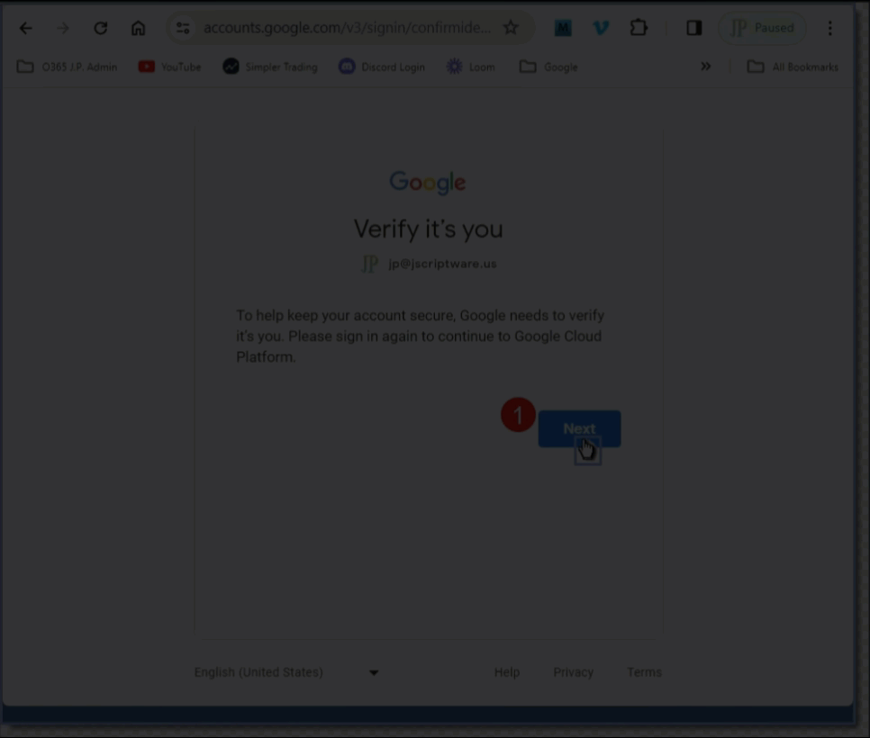
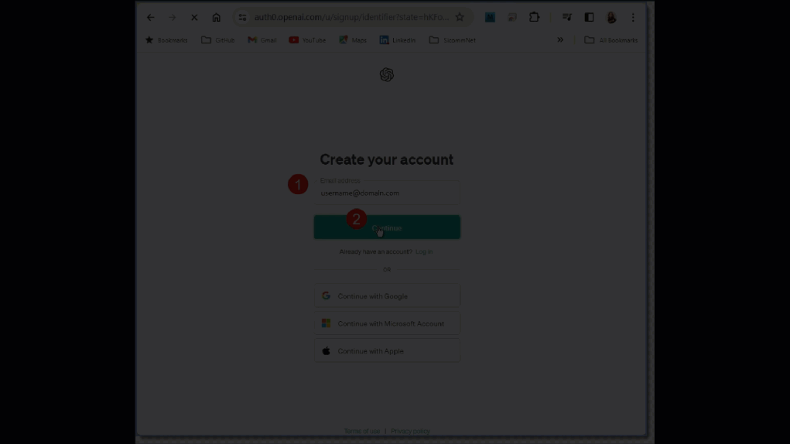

<div style="width: 800px;">

## Integrate OpenAI GPT3 with a Database
### A. Background
 - **Title**: How to integrate OpenAI GPT3 with a Databases - Crash Course - [Video](https://www.youtube.com/watch?v=N4nX_rTwKx4)
 - **GitHub:** adriantwarog/youtube-comments-openai-gpt3 [Repo](https://github.com/adriantwarog/youtube-comments-openai-gpt3.git)
 - **Project App**: c61_llm-comments-db-app

<span id="b1"></span>

### B. Setup
 1. **Clone the Repository**  
    - Open Windows Command or Git Bash terminal   
    `# cd "C:\Repos"    
    ```# git clone https://github.com/robinmattern/AIApps_prod-master  AIApps ```   
      ```
        Cloning into 'AIApps_/dev01-robin'...
        remote: Enumerating objects: 507, done.
        remote: Counting objects: 100% (507/507), done.
        remote: Compressing objects: 100% (372/372), done.
        remote: Total 507 (delta 245), reused 368 (delta 124), pack-reused 0Receiving objects:  91% (462/507)
        Receiving objects: 100% (507/507), 2.90 MiB | 19.40 MiB/s, done.
        Resolving deltas: 100% (245/245), done.
        Updating files: 100% (310/310), done.
      ```   
    `# cd AIApps`   
    `# code AIApps.code-workspace`   
      ```
 <span id="b2"></span>
   
 2. **Install Client Node Modules**  
    - In VSCode, open New Integrated Terminal    
    `# cd ./client6`    
    `# cat package.json`   
      ```
        {
          "dependencies": {
            "dotenv": "^16.4.1",
            "mysql2": "^3.9.1",
            "mysql2-promise": "^0.1.4",
            "googleapis": "^114.0.0",
            "openai": "^3.2.1"
          },
          "type": "module"
        }
      ```
    `# npm install`  
      ```
        added 66 packages, and audited 67 packages in 3m

        15 packages are looking for funding
        run `npm fund` for details

        2 moderate severity vulnerabilities

        To address all issues (including breaking changes), run:
        npm audit fix --force

        Run `npm audit` for details.
      ```
<span id="b3"></span>

 3. **Edit the App package.json file**  
    `# cd ./c61_llm-comments-db-app`    
    `# cat package.json`  
      ```
        {
          "name": "aiapps_client6-c61_llm-comments-db-app",
          "version": "0.1.1",
          "description": "First Node.js AI Client App to label YouTube comments using OpenAI model",
          "Author": "Robin Mattern",
          "main": "index_u03.mjs",
          "scripts": {
            "start":        "node index_u03.mjs",   
            "vueDocs":      "bash ../../docs/run-docsify.sh",   
            "getComments":  "node index_u01.mjs",   
            "savComments":  "node index_u03.mjs insert",   
            "runModel":     "node index_u02.mjs",   
            "test": "echo \"Error: no test specified\" && exit 1"
          },
          "keywords": [],
          "author": "",
          "license": "ISC",
          "dependencies": { },

          "type": "module"
          }
      ```
<span id="b4"></span>

 4. **Create Database and Table**   
   - In MySQL Workbench, create a new schema, named: `comments`   
   - Create a new table, named: `comments`    
      ```
        USE comments;  
        CREATE TABLE comments(  
          id        INT AUTO_INCREMENT KEY,  
          commentid VARCHAR(64),  
          commenter VARCHAR(64),  
          comment   VARCHAR(512),  
          gpt       VARCHAR(512),  
          flag      INT,  
          respond   INT  
          )
      ```
<span id="c5"></span>

### C. Connect to a MySQL database
 5. **Write a simple DB connect script**   
    - In VSCode, open New Integrated Terminal   
    `# cd ./client6/c61*`   
    `# cat 00_db_u01-connect.js`    
      ```
         import dotenv from 'dotenv'; dotenv.config() 
         import mysql  from 'mysql2/promise';

        // 01.1 Write main() function which is run at the end
        //----------------------------------------------------
          async function main() {
            var pConnection 
            try {
            var pConnection = await mysql.createConnection(
                  { host:     process.env.DB1_MYSQL_HOST
                  , user:     process.env.DB1_MYSQL_USER
                  , password: process.env.DB1_MYSQL_PASSWORD
                  , database: process.env.DB1_MYSQL_DATABASE
                  , port:     3306 // Default MySQL port
        //        , pool:     true 
                  } );
                console.log(   `Successful connection to MySQL DB at: ${process.env.DB1_MYSQL_HOST}`);

            } catch( pErr ) {
                console.log(   `Failed to connect to MySQL DB at: ${process.env.DB1_MYSQL_HOST}`);
        //      console.error( `ERROR:`,  pErr );
        //      console.error( `ERROR: ${ pErr }` );
                console.error( `ERROR ${-pErr.errno}: ${pErr.message}` );
                process.exit(1);
            } finally {
            if (pConnection) {
                await pConnection.end();
                }
                }
            } // eof main 
        //----------------------------------------------------

        // 01.2 Call main() function
        //----------------------------------------------------
                main() 

        //----------------------------------------------------
      ```
<span id="c6"></span>

 6. **Add MySQL config paramerters to .env**   
    `# cp  .env_u03  .env`   
    `# cat .env`    
      ```
           GOOGLE_API_KEY = 'xxxxxxxxxxxxxxxxxxxxxxxxxxxxxxxxxxxxxxx'
           OPENAI_API_KEY = 'xxxxxxxxxxxxxxxxxxxxxxxxxxxxxxxxxxxxxxxxxxxxxxxxxxx'

           DB2_MYSQL_HOST     = '127.0.0.1'
           DB2_MYSQL_USER     = 'root'
           DB2_MYSQL_PASSWORD = 'FormR!1234'
           DB2_MYSQL_DATABASE = 'comments'
      ```
<span id="c7"></span>

 7. **Run the DB Connect script**  
    `# node 00_db_u01-connect.js`
      ```
        Successful connection to MySQL DB at: 127.0.0.1
      ```
<span id="d8"></span>

### D. Add a Sample Data Record
 8. **Write an insert function**  
    - In VSCode, open New Integrated Terminal   
    `# cd ./client6/c61*`  
    `# cat 00_db_u01-testInsert.js`  
      ```
        // 03.1 Write insert() function to be run inside main
        //----------------------------------------------------
          async function insert( { pConnection, pComment } ) {      // .(40203.03.1 RAM Was create())
          const [ results ] = await conn.execute(
                 'INSERT INTO comments (commentid, commenter, comment, gpt, flag, respond) VALUES ( ?, ?, ?, ?, ?, ? )'
              , [ pComment.commentid, pComment.commenter, pComment.comment, pComment.gpt, pComment.flag, pComment.respond ]
                );
         return results.insertld;
                }
                
        // 03.2 Use insert() function inside main
        //----------------------------------------------------
          const id = await insert( { pConnection, pComment:         // .(40203.03.2 RAM Was create())
                  { commentid:  1
                  , commenter: "Adrian Twarog"
                  , comment  : "Why did the database go on a diet? It had too many tables!"
                  , spt      : ""
                  , flag     :  0
                  , respond  :  0 
                    }
                  } );
               console.log( `Inserted row id is: ${id}.` );    
      ```
<span id="d9"></span>  

 9. **Write and use a function getDBconfig()**  
    `# cat 00_db_u02-testInsert.js`   
      ```
          async function main() {
            var pConnection 
            var pDBconfig = getDBconfig( 'DB3' )                    // .(40203.05.1 RAM Use getDBconfig())
            try {
            var pConnection = await mysql.createConnection( pDBconfig )
                ... 

        // 05.2 Write getDBconfig() function to be run inside main
        //----------------------------------------------------
        function getDBconfig(aDB) {                                 // .(40203.05.2 RAM Write getDBconfig())
            var pCfg =  
                 { host:     process.env[`#{aDB}_MYSQL_HOST`]
                 , user:     process.env[`#{aDB}_MYSQL_USER`]
                 , password: process.env[`#{aDB}_MYSQL_PASSWORD`]
                 , database: process.env[`#{aDB}_MYSQL_DATABASE`]
                 , port:     3306 // Default MySQL port
                   } 
         return pCfg            
                };
        //----------------------------------------------------
      ```
<span id="d10"></span>

10. **Run the script to insert a test comment record**    
    `# node 00_db_u02-testInsert.js`   
      ```
        Successful connection to MySQL DB at: 127.0.0.1.
        Inserted row id: 1.
      ```
<span id="e10"></span>

### E. Get YouTube comments with Google API   

Go to the Google Cloud Console to create a project, enable the YouTube API and get an API key as follows: 
- Create a project at the [Create Google Project](https://console.cloud.google.com/projectcreate)  
- Then enable the "youtube data api v3" API at the [Get API_KEY](https://console.cloud.google.com/apis/library/browse?q=youtube%20data%20api%20v3)  
- And finally you'll get an API_KEY for it at the [apis/library page]( https://console.cloud.google.com/apis/credentials?project=) <br>   
  

<span id="e11"></span>

11. **Put the Google YouTube API_KEY into .env**   
    - In VSCode, open New Integrated Terminal   
    `# cd ./client6/c61*`   
    `# nano .env`   
      ```
        GOOGLE_API_KEY = 'xxxxxxxxxxxxxxxxxxxxxxxxxxxxxxxxxxxxxxx'
      ```
<span id="e12"></span>

12. **Write a script to get YouTube comments**  
    `# nano 02_comments_u01-testAPI.js`  
      ```
          import   dotenv   from 'dotenv'; dotenv.config() 
          import { google } from 'googleapis';

        // 06.1 Write function getYoutubeComments
        // -------------------------------------------------
            var pYouTube = google.youtube(
                 { version: 'v3'
                 , auth: process.env.GOOGLE_API_KEY
                   } );
        // -------------------------------------------------

          async function getYoutubeComments() {
         return new Promise( ( resolve, reject ) => {
                pYouTube.commentThreads.list(
                 { part:      'snippet'
                 , videoId:   'JTxsNm9IdYU'
                 , maxResults: 100 }
                , (err, res) => {
                   if ( err ) reject( err );
                   resolve( res.data.items );
                   } );
                } );
                } // eof getYoutubeComments 
        // -------------------------------------------------

        // 06.2 Run function getYoutubeComments
        // -------------------------------------------------
            var mComments = await getYoutubeComments();                           
                console.log( `YouTube Comments Returned: ${mComments.length}.` );    
      ```
<span id="e13"></span>

13. **Run script to get YouTube comments. Then turn it into a module script**  
    `# node 02_comments_u01-testAPI.js`  
      ```
        YouTube Comments Found: 100.  
      ```
    `# cp 02_comments_u01-testAPI.js 02_comments_u03-module.mjs`  
    `# nano 02_comments_u03-module.mjs`  
      ```
        // 05.2 Run function getYoutubeComments
        // -------------------------------------------------
        //  var mComments = await getYoutubeComments();                           //#.(40204.05.3 RAM Don't run it now)
        //      console.log( `YouTube Comments Returned: ${mComments.length}.` ); //#.(40204.05.3)

        // 05.3 Export getYoutubeComments
        // -------------------------------------------------
         export default getYoutubeComments                                         //#.(40204.05.3 RAM Export getYoutubeComments)
      ```
<span id="f14"></span>
    
### F. Add YouTube comments to MySQL database 
14. **Write addComments in 01_db_v07-addComments.mjs** 
    `# nano 01_db_u02-addComments.js`  
      ```
        //#01.1 Write main() function which is run at the end
        // 06.1 Change main() into into addComments()) to insert mComments array
        //----------------------------------------------------
        //async function addComments( mComments) {                  // .(40204.07.1 RAM Change main() into addComments())
            var pConnection 
            var pDBconfig = getDBconfig( 'DB3' )                    // .(40203.05.1 RAM Use getDBconfig())
            try {
            var pConnection = await mysql.createConnection( pDBconfig )
                console.log( `Successful connection to MySQL DB at: ${pDBconfig.host}.`);

        // 06.2 Loop through mComments array calling insert() for each one
        //----------------------------------------------------
         for (let i = 0; i < mComments.length; i++) {               // .(40204.08.1 RAM Add loop)
            var pSnippet  =  mComments[i].snippet.topLevelComment.snippet  
            var id = await insert( { pConnection, pComment:         // .(40203.03.2 RAM Use insert, was create())
                   { commentid: mComments[i].id                     // .(40204.08.2 RAM Beg Add data for ith comment)
                   , commenter: pSnippet.authorDisplayName          // .(40204.08.3)
                   , comment  : pSnippet.textOriginal               // .(40204.08.4)
                   , gpt      : ""
                   , flag     : 0
                   , respond  : 0                                    
                     } 
                  } );
                console.log( `Inserted row id: ${id} - '${pSnippet.textOriginal.substr(0,50).replace( /\n/g, "<br>" ) }...'` );    
                }

            } catch( pErr ) {
                console.log(   `Failed to connect to MySQL DB at: ${pDBconfig.host}.`);
                console.error( `ERROR ${-pErr.errno}: ${pErr.message}` );
                process.exit(1);
            } finally {
            if (pConnection) {
                await pConnection.end();
                }
            } // eof addComments
        //----------------------------------------------------

        //#01.2 Call main() function 
        // 06.3 Export addComments() function 
        //----------------------------------------------------
        //      main()                                              //#.(40204.06.3 RAM Don't run main() now)
         export default addComments                                 // .(40204.06.3 RAM Export addComments())
        //----------------------------------------------------
      ```
<span id="f15"></span>

15. **Write and run script to add comments into MySQL DB** 
    `# nano index_u01.mjs`  
      ```
        // 06.4 Import two modules
        //----------------------------------------------------------
         import   getComments   from './02_comments_u02-module.mjs'
         import   addComments   from './01_db_u02-addComments.mjs'

        // 06.5 Get and add comments to database
        //----------------------------------------------------------
            var mComments = await getYoutubeComments() 
          await addComments( mComments )
      ```
    `# node index_u01.mjs`  
      ```
        Successful connection to MySQL DB at: 127.0.0.1.
        Inserted row id: 1118 - '? Try the OpenAI Template - Starter Kit I've made ...'
        Inserted row id: 1119 - 'Thank you...'
        Inserted row id: 1120 - 'My first intro to ChatGPT or anything AI - I'm gon...'
        Inserted row id: 1121 - '0:00: ?? This video is a crash course on using Ope...'
        Inserted row id: 1122 - 'GPTs store popular recommendations:<br>1. The magical...
      ```
<span id="g10"></span>

### G. Run the YouTube comments against OpenAI model, davinci-002 

Go to the OpenAI to ...  as follows: 
- Create a account at the [Create OpenAI Account](https://auth0.openai.com/u/signup/identifier?state=hKFo2SBvN0hObktyZGJWV2NJaVdPVDFsYnpGTGFseUd0ZWpKV6Fur3VuaXZlcnNhbC1sb2dpbqN0aWTZIFFNZElHanh4RV9OLWdLVkRDU184Y21QelA1anYxdVRMo2NpZNkgRFJpdnNubTJNdTQyVDNLT3BxZHR3QjNOWXZpSFl6d0Q)
- Then create a secred key at the [Get API_KEY](https://platform.openai.com/api-keys)  <br>  
  

<span id="g16"></span>

16. **Get OpenAI API_KEY and put it into .env**   
    `# nano .env`   
      ```
        GOOGLE_API_KEY = 'xxxxxxxxxxxxxxxxxxxxxxxxxxxxxxxxxxxxxxx'
        OPENAI_API_KEY = 'xxxxxxxxxxxxxxxxxxxxxxxxxxxxxxxxxxxxxxxxxxxxxxxxxxx'
      ```
<span id="g17"></span>

17. **Write and run a script to test OpenAI model**  
    `# nano 03_ai_u01-testOpenAI.js`  
      ```
      import dotenv from 'dotenv'; dotenv.config()
      import { Configuration, OpenAIApi } from "openai";

      // 09.1 Set OpenAI API_KEY
      // -------------------------------------------------
          var pConfiguration = new Configuration(
              { apiKey      : process.env.OPENAI_API_KEY
      //       , organization: process.env.OPENAI_ORG
                } );

      // 09.2 Run test of OpenAI createCompletion
      try {
        var pOpenAI = new OpenAIApi( pConfiguration );
        var pResponse  = await pOpenAI.createCompletion(
            { model       : "davinci-002"                               // .(40204.9.2 RAM Deprecated: text-davinci-003)
            , prompt      : "Say this is a test"
            , max_tokens  :  7
            , temperature :  0
              } );

        var aResponse = pResponse.data.choices[0].text.trim()
            console.log(   `\nOpenAI API returned: ${aResponse}` );

        } catch( pErr ) {
            console.log(   `\nFailed to process pOpenAI.createCompletion`);
            console.error( `ERROR ${-pErr.errno}: ${pErr.message}` );
            process.exit(1);
        } finally {
            process.exit()
            }
      ```
    `# node 03_ai_u01-testOpenAI.js`  
      ```
        OpenAI API returned: . I'm gonna say this is
      
        ## Possible errors   
        Failed to process pOpenAI.createCompletion
        ERROR NaN: Request failed with status code 429  
        ERROR NaN: Request failed with status code 401             
      ```
<span id="g18"></span>

18. **Write and run script to run comments against OpenAI model**    
    `# nano 03_ai_u02-updateDB.js`   
      ```
        import dotenv from 'dotenv'; dotenv.config() 
        import { Configuration, OpenAIApi } from "openai";
        import doComments from './01_db_u03-module.mjs'    // .(40204.07.11 RAM New module)

        // 09.1 Set OpenAI API_KEY
        // -------------------------------------------------
        var pConfiguration = new Configuration(
                 { apiKey      : process.env.OPENAI_API_KEY
        //       , organization: process.env.OPENAI_ORG
                   } );
            var pOpenAI        =  new OpenAIApi( pConfiguration );

        //#09.3 Write function updateDatabaseUsingGPT
        // 09.5 Refactor function updateDatabaseUsingGPT to take aPromptTemplate, mComments as arguments
        // -------------------------------------------------
          async function updateDatabaseUsingGPT( aPromptTemplate, mComments ) {                   // .(40204.09.5 RAM Add Arguments) 
                mComments  =  mComments ?  mComments : [ { id: 1, commenter: '', comment: '' } ]  // .(40204.09.6 RAM Make mComents optional)

                console.log( `Running ${mComments.length} comments against OpenAI 'davinci-002' model.` )
           try {
           for (var i = 0; i < mComments.length; i++) {

                var aPrompt =  aPromptTemplate                                                    // .(40204.09.7 Update template)
                var aPrompt =  aPrompt.replace( /{Commenter}/, mComments[0].commenter )           // .(40204.09.8)
                var aPrompt =  aPrompt.replace( /{Comment}/,   mComments[i].comment   )           // .(40204.09.9)

                var pResponse = await pOpenAI.createCompletion(
                     { model :     "davinci-002"                    // .(40204.09.2 RAM Deprecated: text-davinci-003)
                     , prompt:      aPrompt 
                     , stop:        [ "\n", "User:", "Comment:", "Should Reply:" ]
                     , max_tokens:  7
                     , temperature: 0
                       } );
                var aResponse = pResponse.data.choices[0].text.trim()    
                    console.log( `Comment Id ${mComments[i].id} response: ${aResponse}` );

                if (aResponse == "Yes") {
              await doComments( 'update',[ mComments[i].id ] );
                    console.log( `Comment Id ${mComments[i].id} updated` )
                    } // if comment respond = "Yes"

                } // eol for each mComments  

            } catch( pErr ) {
                console.log(   `Failed to process pOpenAI.createCompletion`);
                console.error( `ERROR ${-pErr.errno}: ${pErr.message}` );
                process.exit(1);
            } finally {
                process.exit()
                }        
            } // eof updateDatabaseUsingGPT
        // --------------------------------------------------------

        // 09.6 Run function, updateDatabaseUsingGPT
        // -------------------------------------------------
            var aPrompt1 = "Say this is a test"

            var aPrompt2 = `The following AI tool helps YouTubers identify if a comment can should be replied to or not.\n`
                            + `Questions and/or asking for advice are good examples of when a reply is needed.\n\n` 
                            // Context Example 1
                            + `User: John Smith\n` 
                            + `Comment: That was a great video, thanks!\n` 
                            + `Should Reply: No\n\n` 

                            // Context Example 2
                            + `User: Sue Mary\n` 
                            + `Comment: I'm stuck on step four, how do I do it?\n` 
                            + `Should Reply: Yes\n\n` 

                            // Actual use case
                            + `User: {Commenter}\n` 
                            + `Comment: {Comment}\n` 
                            + `Should Reply:`

                            await doComments( 'connect' );
          var mComments2 =  await doComments( 'select'  );

        //    updateDatabaseUsingGPT( aPrompt1 );
              updateDatabaseUsingGPT( aPrompt2, mComments2 );

        // --------------------------------------------------------
      ```
    `# node 03_ai_u02-updateDB.js`   
      ```
        Successful connection to MySQL DB at: 127.0.0.1.
        Selected 20 rows from comments table
        Running 20 comments against OpenAI 'davinci-002' model.
        Comment Id 2322 response: No
        Comment Id 2323 response: No
        Comment Id 2324 response: No
        Failed to process pOpenAI.createCompletion
        ERROR NaN: Request failed with status code 429
        Process exited with code 1
      ```
<span id="g19"></span>

19. **Add Bard's function, throttledCreateCompletion**   
    `# cp 03_ai_u02-updateDB.js 03_ai_u03-module.mjs`   
    `# nano 03_ai_u03-module.mjs`   
      ```
         import { promisify } from "util"; const wait = promisify( setTimeout );  // .(40206.02.1 BARD Write wait function)
            ... 
            var pResponse = await throttledCreateCompletion( pRequest, nWaitSecs) // .(40206.06.1 RAM Add nWaitSecs).(40206.02.2 RAM Run every minute) 
            ... 
          async function throttledCreateCompletion( pRequest, nWaitSecs ) {       // .(40206.06.1).(40206.02.3 BARD Write function)
          const dStartTime   = Date.now();
        //const pResponse    = await pOpenAI.createCompletion( pRequest );
          const dElapsedTime = Date.now() - dStartTime;
          const dWaitTime    = Math.max( 0, (nWaitSecs * 1000) - dElapsedTime);   // .(40206.06.1 RAM Add nWaitSecs).(40206.02.3 BARD Wait at least 1 second)
                await wait( dWaitTime );
          const pResponse    = await pOpenAI.createCompletion( pRequest );
         return pResponse;
                }                                                                 // .(40206.02.3 BARD End)
      ```
<span id="g20"></span>

20. **Write and run simple script to process 5 comments**   
    `# nano index_u02.mjs`   
      ```
        // 06.4 Import two modules
        //----------------------------------------------------------
         import doComments   from './01_db_u03-module.mjs'         // .(40204.07.11 RAM New module)
         import getComments  from './02_comments_u03-module.mjs'
         import updComments  from './03_ai_u03-module.mjs'         // .(40204.10.3 RAM New module)

        // 06.5 Get and add comments to database
        //----------------------------------------------------------
            var mComments =  await getComments( 5 ) 
          await doComments( 'connect' )                             // .(40204.07.13 RAM Use new connect option)
          await doComments( 'delete'  )                             // .(40204.07.14 RAM New delete option)
          await doComments( 'insert', mComments )

        // 11.6 Get and store results of running OpenAI model on mComments to database
        //----------------------------------------------------------
          await doComments( 'connect' )                             // .(40204.07.13 RAM Use new connect option)
          await updComments('all', 'davinci-002' )                 // .(40204.10.4 RAM New AI method)
      ```
    `# node index_u02.mjs`  
      ```
        Retreiving 5 comments from google.youtube.commentThreads API

        Successful connection to MySQL DB at: 127.0.0.1.
        Deleted all rows from comments table
        Inserting 5 comments into MySQL database.
        Inserted row id: 2312 - '? Try the OpenAI Template - Starter Kit ...'
        Inserted row id: 2313 - 'Thank you...'
        Inserted row id: 2314 - 'My first intro to ChatGPT or anything AI...'
        Inserted row id: 2315 - '0:00: ?? This video is a crash course on...'
        Inserted row id: 2316 - 'GPTs store popular recommendations:<br>1. T...'

        Successful connection to MySQL DB at: 127.0.0.1.
        Selected 5 rows from comments table
        Running 5 comments against OpenAI 'davinci-002' model.
        Submitting prompt every 20 secs (15:42:55).
        Comment Id 2312 response: No  (15:43:22)
        Comment Id 2313 response: No  (15:43:42)
        Comment Id 2314 response: No  (15:44:03)
        Comment Id 2315 response: Yes (15:44:23); Updated: '0:00: ?? This video is a crash course on...'
        Comment Id 2316 response: No  (15:44:43)

        AI Model update completed.
      ```
<span id="h21"></span>

### H. Refactor DB and main index scripts    
21. **Refactor addComments into doComments**   
    `# cp 01_db_v07-addComments.mjs 01_db_u03-module.mjs`    
    `# nano 01_db_u03-module.mjs`    
      ```
        //#01.1 Write main() function which is run at the end
        //#06.1 Change main() into into addComments()) to insert mComments array
        // 07.4 Turn addComments() general SQL exec function
        //----------------------------------------------------
        //async function addComments( mComments) {                  //#.(40204.07.1 RAM Change main() into addComments())
          async function doComments( aVerb, mComments ) {           // .(40204.07.4 RAM Change addComments() into execComments() )
            var pConnection 
            var pDBconfig = getDBconfig( 'DB3' )                    // .(40203.05.1 RAM Use getDBconfig())
            try {
            var pConnection = await mysql.createConnection( pDBconfig )
        //      console.log( `Successful connection to MySQL DB at: ${pDBconfig.host}.`);

        // 03.2 Use insert() function inside main
        // 07.5 Add switch statement 
        //----------------------------------------------------
         switch(aVerb) {

          case 'lengths':  
        // 07.14 Loop through mComments displaying length of each comment
        //----------------------------------------------------
         for (let i = 0; i < mComments.length; i++) {               // .(40204.07.14 RAM Add loop to get length)
            var pSnippet  =  mComments[i].snippet.topLevelComment.snippet  
                console.log( i, pSnippet.textOriginal.length );     // max: 3365 
                }
                break;

          case 'insert':  
        // 06.2 Loop through mComments array calling insert() for each one
        //----------------------------------------------------
         for (let i = 0; i < mComments.length; i++) {               // .(40204.08.1 RAM Add loop)
            var pSnippet  =  mComments[i].snippet.topLevelComment.snippet  
            var id = await insert( { pConnection, pComment:         // .(40203.03.2 RAM Use insert, was create())
                   { commentid: mComments[i].id                     // .(40204.08.2 RAM Beg Add data for ith comment)
                   , commenter: pSnippet.authorDisplayName          // .(40204.08.3)
                   , comment  : pSnippet.textOriginal               // .(40204.08.4)
                   , gpt      : ""
                   , flag     : 0
                   , respond  : 0                                    
                     } 
                  } );
                console.log( `Inserted row id: ${id} - '${pSnippet.textOriginal.substr(0,50).replace( /\n/g, "<br>" ) }...'` );    
                }
                break;

        // 07.6 Delete all records from comments table
        //----------------------------------------------------
          case 'delete':  
                await pConnection.execute( 'DELETE FROM comments;' );
                console.log( `Deleted all rows from comments table`);    
                break;

        // 07.7 Select all records from comments table
        //----------------------------------------------------
          case 'select': 
          var   aWhere = mComments ? `WHERE ${mComments}`  : ''                             // .(40204.12.1)  
          var [ rows ] = await pConnection.execute( `SELECT * FROM comments ${aWhere}` );   // .(40204.12.2 RAM Add Where clause)  
         return rows;
                break;

        // 07.8 Select all records from comments table
        //----------------------------------------------------
          case 'update':  
            var aCommentId = mComments[0]
                await pConnection.execute( `UPDATE comments SET respond = 1 WHERE id = ${aCommentId}`);
                break;

        // 07.12 Connect
        //----------------------------------------------------
          case 'connect':                                              // .)40204.07.12 RAM Added verb: connect)
                console.log( `Successful connection to MySQL DB at: ${pDBconfig.host}.`);
         return pConnection      
                break;

        // 07.9 Unknown doComments verb 
        //----------------------------------------------------
              default: 
                console.log( `ERROR: Unknown doComments verb: ${aVerb}.`)
                break;
              } 
        //----------------------------------------------------

            } catch( pErr ) {
                console.log(   `Failed to connect to MySQL DB at: ${pDBconfig.host}.`);
                console.error( `ERROR ${-pErr.errno}: ${pErr.message}` );
                process.exit(1);
            } finally {
            if (pConnection) {
                await pConnection.end();
                }
                }
            } // eof main 
        //----------------------------------------------------

        //#01.2 Call main() function 
        //#06.3 Export addComments() function 
        // 07.10 Export doComments() function 
        //----------------------------------------------------
        //      main()                                              //#.(40204.07.2 RAM Don't run main() now)
        //xport default addComments                                 //#.(40204.07.10 RAM Don't export addComments()).(40204.07.2 RAM Export addComments())
         export default doComments                                  // .(40204.07.10 RAM Export doComments())
        //----------------------------------------------------
      ```
<span id="h22"></span>

22. **Write improved script to test multiple processes**   
    `# nano index_u03.mjs`   
      ```
        // 11.3 Import three modules
        //----------------------------------------------------------
        //mport addComments        from './01_db_u02-module.mjs'  
         import doComments         from './01_db_u03-module.mjs'    // .(40204.07.11 RAM New module)
         import getComments        from './02_comments_u03-module.mjs'
         import updComments        from './03_ai_u03-module.mjs'    // .(40204.10.3 RAM New module)

            var TheDB    = 'DB3'

            var TheCount =  20            // .(40206.04.6 RAM Add TheCount) 

            var TheModel = 'davinci-002'  // .(40205.13.1 RAM Add most expensive model)
        //  var TheModel = 'curie-001'    // .(40205.13.1
        //  var TheModel = 'ada'          // .(40205.13.1 RAM Add least expensive model)

         // var aTests = "update,show"    // Runs the AI Model for each comments and updates the database   
        //  var aTests = "insert"         // Gets the Google Data and stores it in the database  
            var aTests = "insert,update,show"     
        //  var aTests = "select"     
            var aTests = "test"     
            var bRun   =  0

            var aTests = (process.argv[2] ? process.argv[2] : aTests)
                console.log("") 

        // 09.2 Get and add comments to database
        //----------------------------------------------------------
        /*
            var mComments = await getComments() 
                            await addComments( mComments )          //#.(40204.07.8 RAM)
                            await doComments( 'insert', mComments ) // .(40204.07.8 RAM New syntax)
        */        
        // 11.4 Insert Youtube comments into database
        //----------------------------------------------------------
          if (aTests.match( /insert/ )) { bRun = 1                  // .(40205.11.4 RAM New delete optione)
            var mComments = await getComments( TheCount )           // .(40206.04.7 RAM Add TheCount) 
        //                  console.log( `Retreived ${mComments.length} comments from the Google YouTube API`)
                            await doComments( 'connect', TheDB )    // .(40204.07.13 RAM Use new connect option)
                            await doComments( 'delete'  )           // .(40204.07.14 RAM New delete option)
                            await doComments( 'insert', mComments )           
                } // eif insert

        // 11.5 Test running OpenAI API model
        //----------------------------------------------------------
          if (aTests.match( /test/   )) { bRun = 1                  // .(40205.11.4 RAM New test option)
        //                  await doComments( 'connect', TheDB )    // .(40204.07.13 RAM Use new connect option)
                            await updComments( 'test', TheModel )   // .(40205.11.5 RAM Test OpenAI API)
              } // eif test

        // 11.6 Get and store results of running OpenAI model on mComments to database
        //----------------------------------------------------------
          if (aTests.match( /update/ )) { bRun = 1                  // .(40205.11.6 RAM Run update optione)
                            await doComments( 'connect', TheDB )    // .(40204.07.13 RAM Use new connect option)
          //  var mComments = await getComments() 
            var mComments = await doComments( 'select' ) 
        //                  console.log( `Retreived ${mComments.length} comments from the Google YouTube API`)
        //                  await doComments( 'lengths', mComments) // .(40204.07.4 RAM New syntax)
        //                  process.exit()
        //                  await doComments( 'delete'  )           // .(40204.07.14 RAM New delete option)
        //                  await doComments( 'insert', mComments ) // .(40204.07.8 RAM New syntax)
                            await updComments( 'all', TheModel )    // .(40205.13.2 RAM Add TheModel).(40204.10.4 RAM New AI method)
            } // eif update

        // 11.7 Show Comments with Respond = 1 
        //----------------------------------------------------------
          if (aTests.match( /select/ )) { bRun = 1
        //await doComments( 'connect', aDB )                        //#.(40204.07.13 RAM Use new connect option)
          await doComments( 'connect', TheDB )                      // .(40204.07.13 RAM Use TheDB)
            var mComments = await doComments( 'select', 'respond = 1' ) // .(40204.07.15 RAM New syntax)
                console.log( "Commenter            Comment" )  
                console.log( "-------------------- --------------------------------------------------" )  
            if (mComments.length > 0) {
                mComments.map( ( pComment, i ) => { 
                  console.log( i+1, pComment.commenter.padEnd(25), pComment.comment.substr( 1, 50 ) + "..." )  
                  } ) // eol mComments
              } else {      
                console.log( "no comments with response = 1" )  
                } // eif no mComments
              } // eif show

        // 11.8 Invalid aTests cmd
        //----------------------------------------------------------
         if (bRun == 0) {
             console.log( "  Syntax: index_u03.mjs {aCmd}")
             console.log( "    aCmd    Command" )
             console.log( "    ------  --------------------------------------" )
             console.log( "    test    Test OpenAI model with simple prompt" )
             console.log( "    insert  Insert comments into database from Google YouTube API" )
             console.log( "    update  Update comments after running OpenAI model" )
             console.log( "    select  Select comments with respond = 1" )
             }
<span id="h23"></span>
 
23. **Run improved script to test multiple processes**   
    `# node index_u03.mjs`   
      ```
          Syntax: index_u03.mjs {aCmd}
            aCmd    Command
            ------  --------------------------------------
            test    Test OpenAI model with simple prompt
            insert  Insert comments into database from Google YouTube API
            update  Update comments after running OpenAI model
            select  Select comments with respond = 1
      ```
    `# node index_u03.mjs test`   
      ```
        Running 1 comments against OpenAI 'davinci-002' model.
        Submitting prompt every 20 secs (16:03:40).
        Comment Id 1 response: . I'm gonna say this is (16:04:00)

        AI Model test completed.      
      ```

<span id="i24"></span>

### I. Create your own repository    

24. **Setup a new repository**    
    `## -- To create and save your own repository`    
    `# cd  /C/Repos`     
    `# git init /AIApps_/dev01-username`   
    `# git git config --global core.eol lf`   
    `# git git config user.name  "User Name"`   
    `# git git config user.email "user.name@domain.com"`   
    `# git remote set-url origin git@github-usr:accountname/AIApps_dev01-username.git`   
    `# gh  repo create AIApps_dev01-username --public`     
    `# git config --local --list`   
    ```
        Initialized empty Git repository in C:/Repos/AIApps_/dev01-username/.git/
        ✓ Created repository accountname/AIApps_dev01-username on GitHub
        remote.origin.url=git@github-sue:accountname/AIApps_dev01-username.git
        remote.origin.fetch=+refs/heads/master:refs/remotes/origin/master
        user.name=User Name
        user.email=user.name@domain.com
    ```
<span id="i25"></span>

25. **Create an empty app folder in client6 from template**    
    `# cd /C/Repos/AIApps_`    
    `# cp -r dev01-robin/._2/FRTs/MT  dev01-username`   
    `# cp -r dev01-robin/client0      dev01-username/client6`   
    `# cd dev01-username/client6`  
    `# git clone https://github.com/adriantwarog/youtube-comments-openai-gpt3.git  c60o_llm-comments-db-app_vOrig`

        Cloning into 'c60o_llm-comments-db-app_vOrig'...
        remote: Enumerating objects: 11, done.
        remote: Counting objects: 100% (11/11), done.
        remote: Compressing objects: 100% (10/10), done.
        remote: Total 11 (delta 0), reused 11 (delta 0), pack-reused 0
        Receiving objects: 100% (11/11), 20.34 KiB | 365.00 KiB/s, done.git config --global core.eol lf

<span id="i26"></span>

26. **Update your repository in Github**    
    `# cd  /C/Repos/AIApps_/dev01-username`     
    `# echo .env >.gitignore`   
    `# git add .`   
    `# git commit -a "First Commit"`   
    `# git push`     

      [main (root-commit) 3494b45] First Commit
      4 files changed, 3 insertions(+)
      create mode 100644 .gitignore
 
      Enumerating objects: 5, done.
      Counting objects: 100% (5/5), done.
      Delta compression using up to 24 threads
      Compressing objects: 100% (2/2), done.
      Writing objects: 100% (5/5), 304 bytes | 304.00 KiB/s, done.
      Total 5 (delta 0), reused 0 (delta 0), pack-reused 0
      To github-sue:suzeeparker/AIApps_dev02-suzee.git
      * [new branch]      main -> main
      branch 'main' set up to track 'origin/main'.    

<span id="i27"></span>

27. **Update your or the master repository from Github**   

    `## -- Backup the repository if necessary`   
    `# cp /C/Repos/AIApps_/dev01-username  /C/Repos/AIApps_/dev01-username_vYMMDD`  
    `# cd /C/Repos/AIApps_/dev01-username`   
    `# git pull`    

<div style="height:1000px;"></div>
</div>
