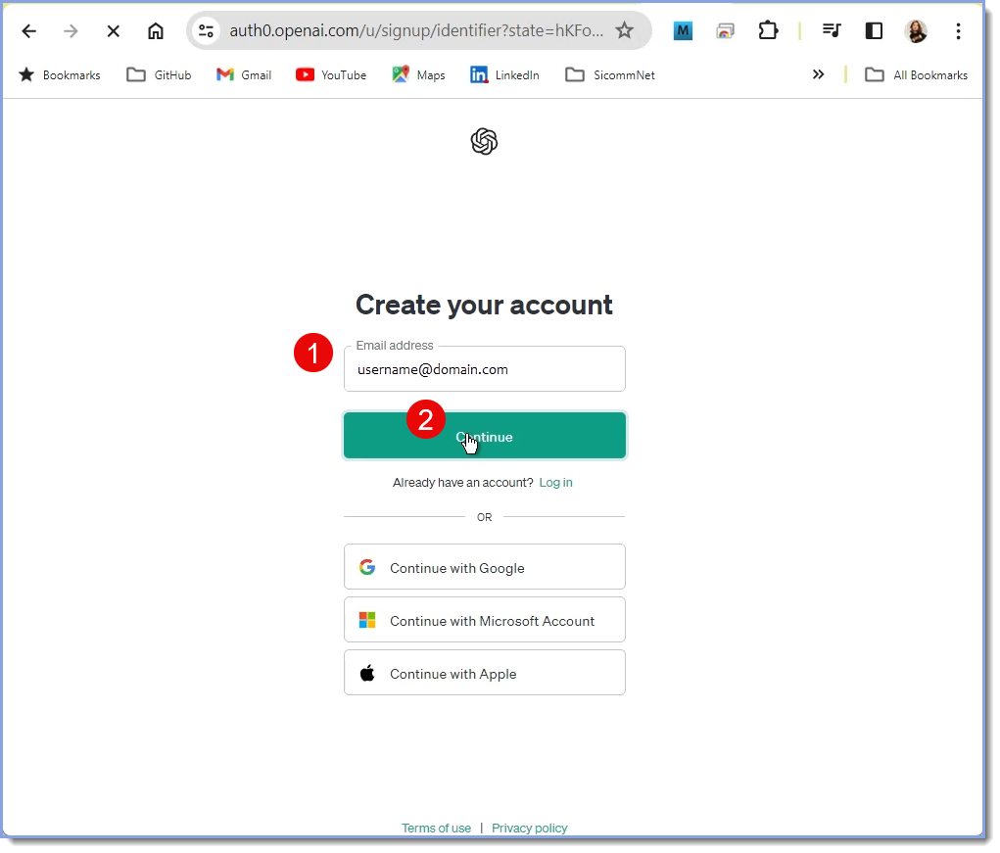
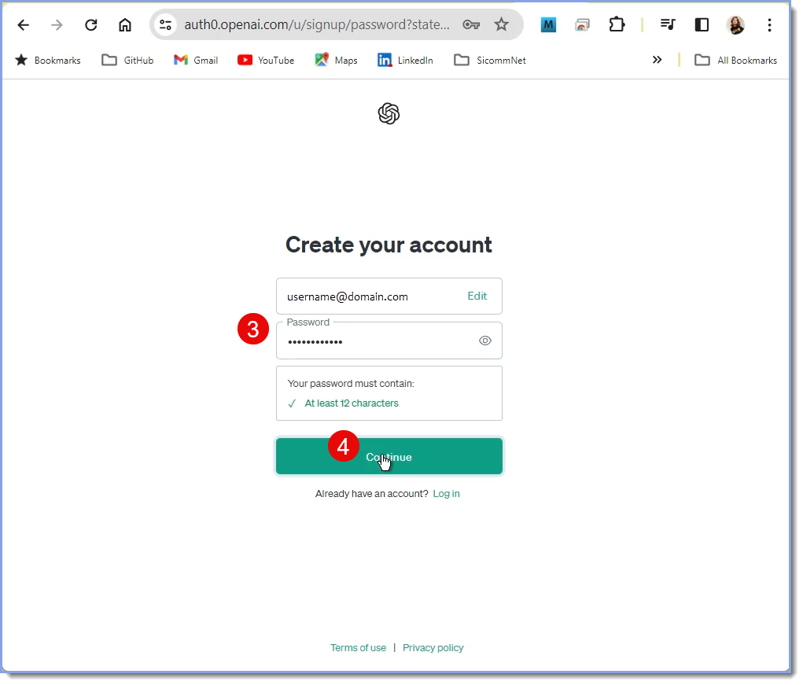
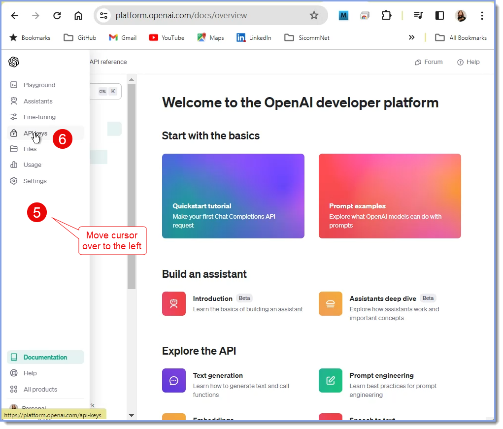
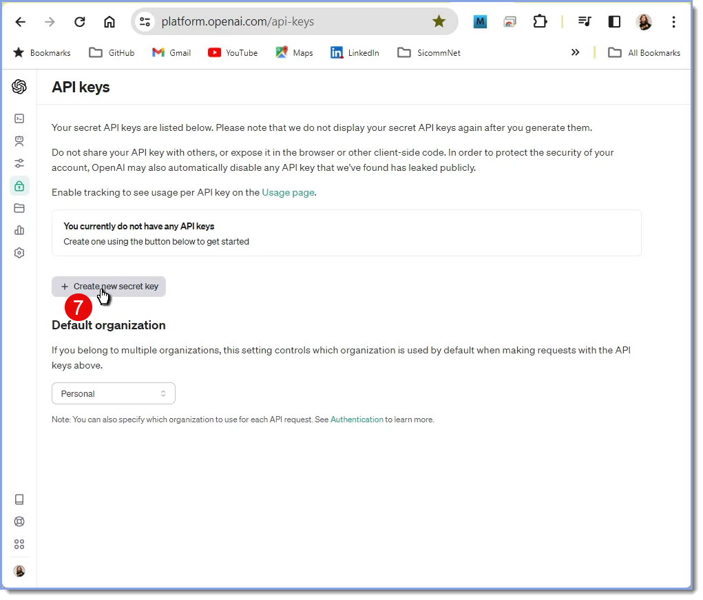
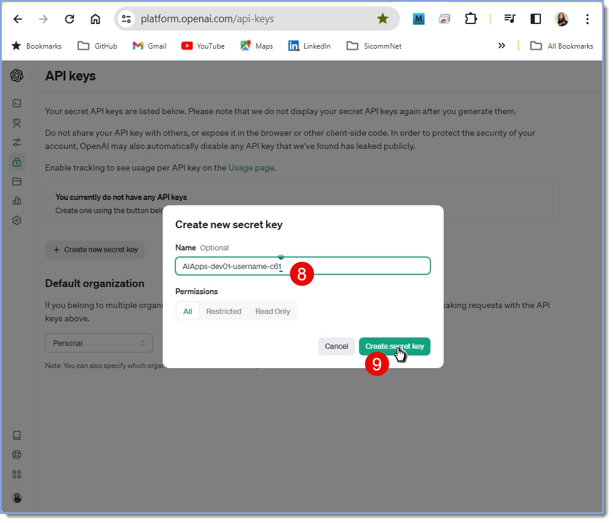
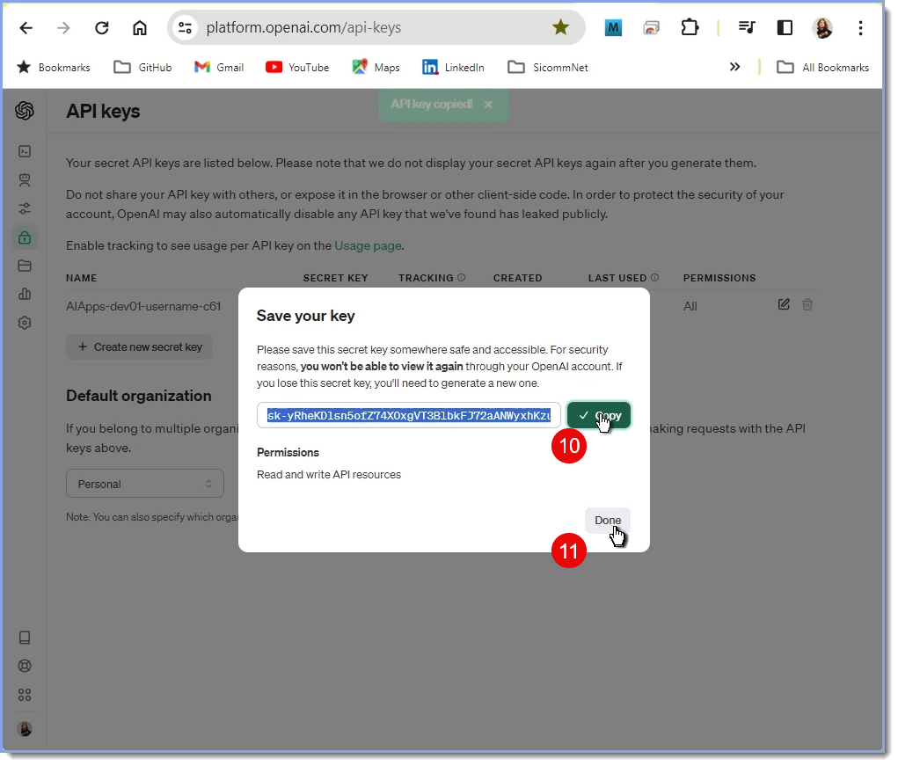
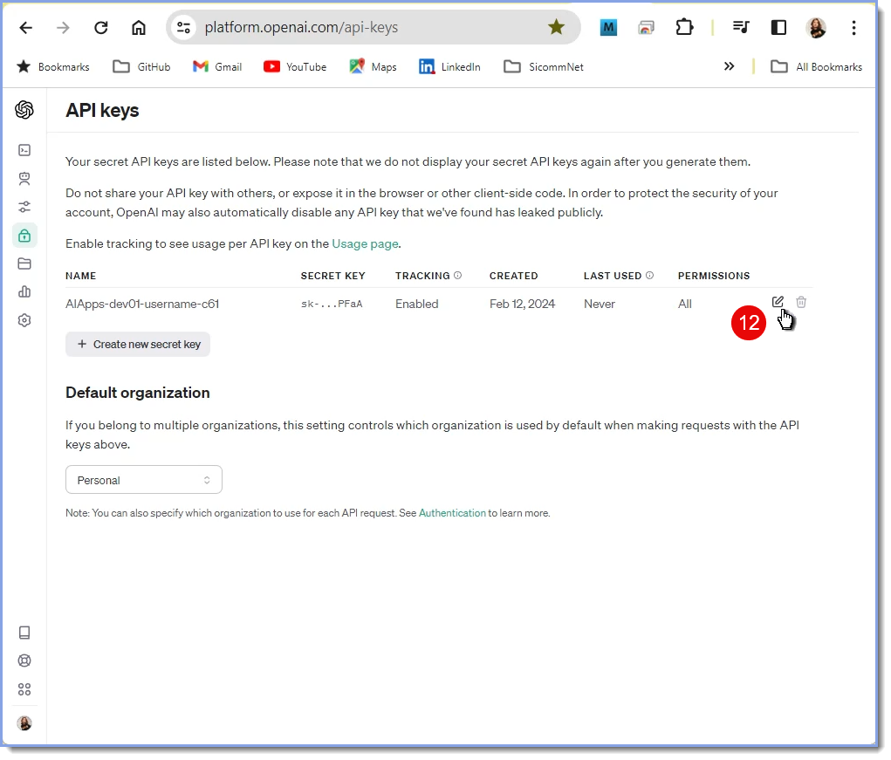

### E. Get Google YouTube API_KEY      

- First go here to [Create an OpenAI Account](https://auth0.openai.com/u/signup/identifier?state=hKFo2SBvN0hObktyZGJWV2NJaVdPVDFsYnpGTGFseUd0ZWpKV6Fur3VuaXZlcnNhbC1sb2dpbqN0aWTZIFFNZElHanh4RV9OLWdLVkRDU184Y21QelA1anYxdVRMo2NpZNkgRFJpdnNubTJNdTQyVDNLT3BxZHR3QjNOWXZpSFl6d0Q)

 + Steps 1, 2, 3 and 2 - Enter new account email address and password +

    
    1. Enter a new OpenAI Account `Email address`
    2. Click on button, `Continue`

    
    3. Enter a new Open Account `Password`
    4. Click on button, `Continue`
    
 + Steps 5 and 6 - Open APIkeys page +

    
    5. Move cursor over left edge of browser window
    6. Click on menu item, `APIkeys`

 + Steps 7, 8, 9 - Create new key +

    
    7. Click on button, `Create new secret key`    

    
    8. Enter name of secret key: `AIApps-dev01-username-c61`    
    9. Click on button, `Create secret key`   

 + Steps 10 and 11 - Copy the API_KEY +

    
    10. Click on button, `Copy`    
    11. Click on button, `DONE` 

 + Step 12 - View the API_KEY +

    
    12. Click on icon, `Edit`, to view it   
    
11. **Put OpenAI API_KEY into .env**     ([view code](setup/d61_llm-comments-db-app/d61-01_build-log.md?id=g16)) 
