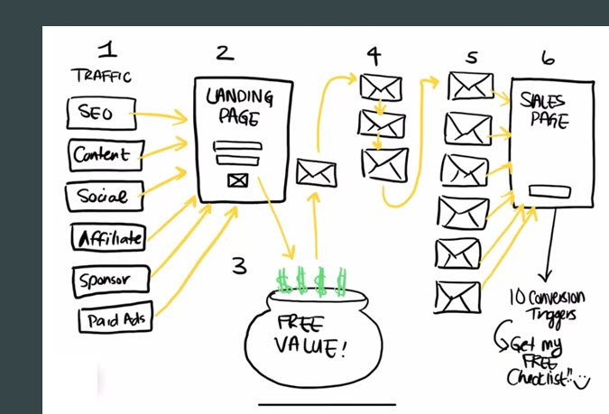

## IceWarp Free Trial Promotion

### A. Front Page Look and Feel

In general the website is beautifully done.  I'll say that the main page and the 
Product page is typical of many sales pages in the it is filled with tons of 
information that only someone interested in the product would read through.  It doesn't
serve to gnerate interest.  Particularity those have heard about IceWarp as an 
alternative to Microsoft exchange.   

Assuming that the main page is where you would want to capture the email address of
prospects who need to be sold, the contract info page is way at the bottom and a bit 
difficult to get through. 

### B. Three "free" Offers

1. **Free Trial** 
The only mention of a "free for 1 month" offer is the button at the top, otherwise 
the page is a product brochure.  When you click on the button, you go to the Pricing 
page, which barely mentions the free month.  There isn't anything special about it. 
And I've never understood why companies offer a free trial for the inexpensive version.
Why would the company or the prospect want to try out the inferior version.     

   When you click on the "Get Startup package" or "Get Business", you're taken through 
   a technically nice contact info gathering form, but it's long and will only be filled 
   about by serious prospects.  In terms of the sell cycle this is one step away 
   from a sale.  Asking for a credit card reinforces this.  

<!-- [Free for 1 month Form](webpages/Notes/VIDs/3d40221-05_Free-Form.mp4 ':include :type=mp4')   -->
<!-- [video.mp4](webpages/Notes/video.mp4 ':include :type=mp4')     -->
   - [Free for 1 month Form video](webpages/Notes/3d40221-05_Free-Form.md)                             
   
2. **Demo** 
The other way to get a free trial is to go through the Demo.  It is a strange instance 
of an annotated live session, in which you can also download the product without entering
any contract information.   

- [Demo Video](webpages/Demo/3d40221-02_Demo-Video.md)

3. **Product Downloads** 
I'm not sure how usable these download are without a license, but you don't ask for any 
contact information.  
- [Downloads](https://www.icewarp.com/downloads/initial/) 

### B. Marketing Funnel

My main takaway is that you should think of the typical Sales Funnel:   

1. You should do whatever you can to generate traffic, i.e. awareness of your 
   product.  I sure you know all this, but puttling links from other websites is a 
proven method. 
2. Create a "Landing Page" that offers something of value to the prospect in 
   return for their email address.  All you want is their email address so make
   it really easy.  Videos and shideshows should be swapped out regularly to give 
   returning prospects something new.  White papers, either your own, or those of
   others, i.e. "leave behinds" are good too. 
   
   You have a lot of good content that could be used.  See Assets links below. 

3. Emails that educate and get people to a landing page in order to get prospects "opt-in" ie. give you their email address
4. Last round of emails that have a Buy Now link on them that takes them to the Sales page.
5. The Sales page.  This is essentially what your website is now.  

### C. Assets

- [SlideShow html](webpages/SlideShow/3d40221_IceWarp-Slideshow.md)  
- [Slideshow mp4 ](webpages/Notes/3d40221_IceWarp-Slideshow.md)
- [Icewarp Demo  ](https://www.icewarp.com/preview-epos/start) 

